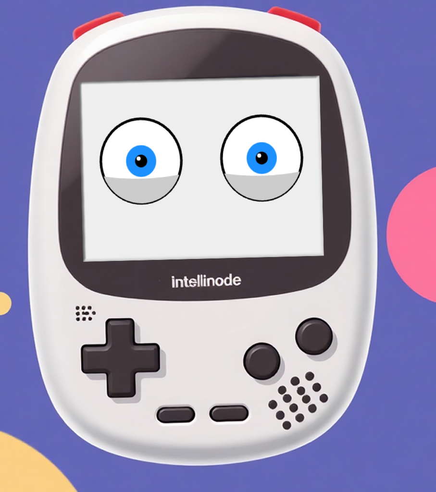
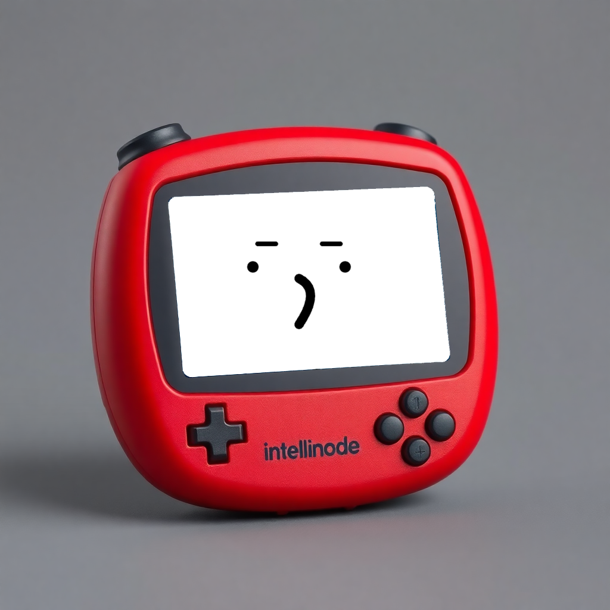
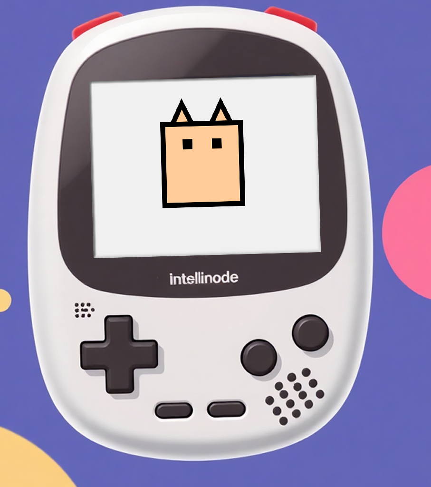
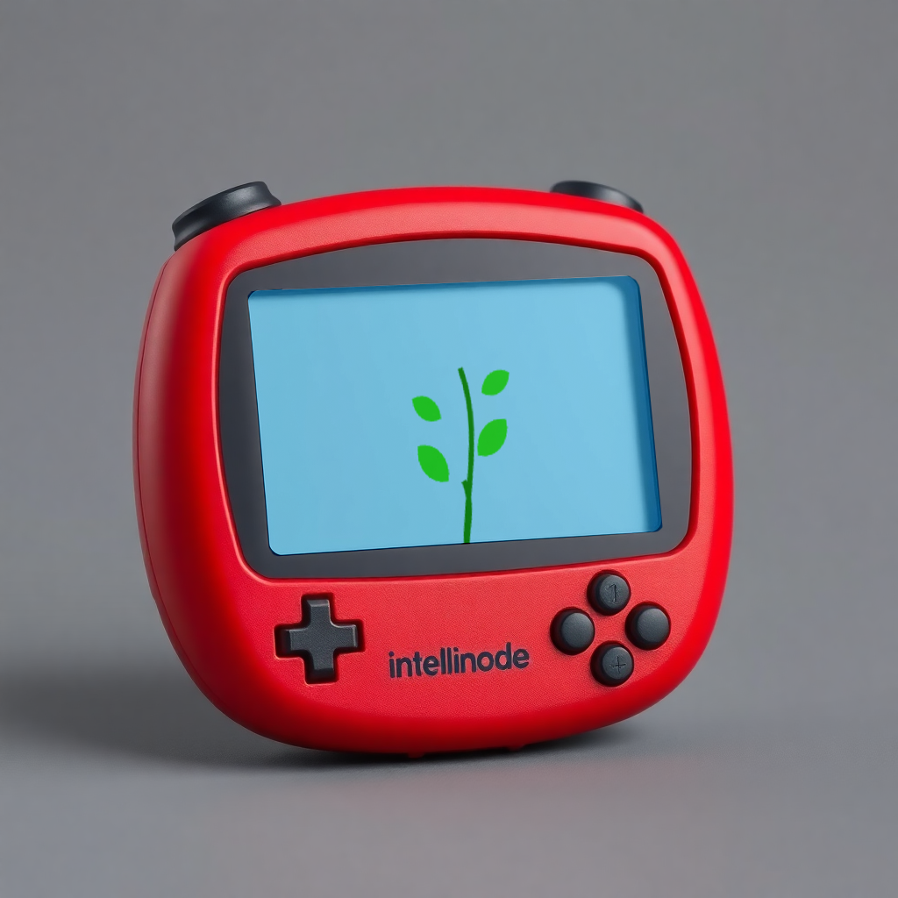

# AnimatAI
A collection of tamagotchi characters to give AI assistants an identity.

# Tamagotchi

This project is inspired by the classic Tamagotchi device, featuring a virtual character drawn with JavaScript. The character can be controlled through various buttons, or it can dynamically change based on interactions with an AI assistant.

## How to Use:

1. **Manual Mode**: Click on the buttons to perform actions.
2. **AI-Controlled Mode**: Connect this with an AI assistant to automatically update the character.

Feel free to customize the project, or expand it for AI assistant interaction.

## AI Characters:

### Eyes

### Notion

### Cat

## Plant

## How to Connect to Chatbot:

Call `setAction` based on the AI model’s status or reactions. For example:

- `setAction('curious')` if the AI’s response includes a question.
- `setAction('excited')` if the response shows excitement.
- `setAction('speaking')` for general replies.

Check the [demo](https://animat.fun/) for more action details.
